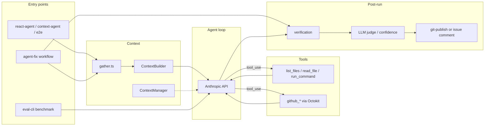

# Architecture

This document describes the **token-lab** agent system as implemented in `src/`. The core is a ReAct loop (`ReactAgent`) around the Anthropic Messages API, with workspace and GitHub tools, optional RAG/episodic context, guardrails, verification, evaluation, and a GitHub Actions workflow for automated issue fixes.

## System overview

## Core components

| Layer | Module | Role |
|-------|--------|------|
| Agent | `react-agent.ts` | ReAct loop: LLM → tools → append results; guardrails; optional scratchpad, context compression, HITL, reflection, Langfuse |
| Tools | `tool-loop.ts`, `tool-registry.ts` | Parallel execution by dependency group; routes `github_*` vs workspace tools |
| Workspace | `tools.ts` | `list_files`, `read_file`, `run_command` (path-safe, sandboxed tests when enabled) |
| GitHub | `github/toolkit.ts` | Octokit tools: issue read, remote files, branch/commit/PR |
| Context | `context/gather.ts`, `builder.ts`, `manager.ts` | Issue + repo tree + RAG + episodes + tool history; rolling summary when history exceeds budget |
| Memory | `memory/scratchpad.ts`, `episodes.ts`, `episode-store.ts` | In-run structured state; pgvector episodic recall after runs |
| RAG | `rag/store.ts`, `chunker/`, `embeddings/` | Code chunks in PostgreSQL/pgvector; OpenAI embeddings |
| Verification | `verification/runner.ts` | Git diff, blocked paths, `npm run build`, `npm test` (optional Docker sandbox) |
| Observability | `trace/agent-trace.ts`, `trace/langfuse-tracer.ts` | In-memory traces; optional Langfuse OTEL export |
| Cost | `cost/pricing.ts` | Per-call USD from token counts; optional `REACT_MAX_COST_BUDGET` |
| Eval | `eval/metrics.ts`, `judge.ts`, `agent-runner.ts`, `benchmark.ts`, `regression.ts`, `failure-analysis.ts` | Retrieval + agent metrics, LLM judge, versioned runs, failure taxonomy |
| Production | `github/agent-fix.ts`, `confidence.ts`, `git-publish.ts` | GitHub Actions issue-fix pipeline |

## Data flow

### Standard agent run

1. **Entry** — CLI passes a task string (`react-agent-cli.ts`) or rich context (`context-agent-cli.ts`, `e2e/run.ts`).
2. **Context** — `createContextBuilder` (`context/gather.ts`) loads issue text (GitHub API or inline), repo tree (depth 2), RAG chunks, and similar episodes when `DATABASE_URL` is set. `ContextBuilder.buildSystem()` assembles the system prompt each turn.
3. **Loop** — `ReactAgent.run()` calls the LLM with tools. `executeTools` (`tool-loop.ts`) groups independent `tool_use` blocks and runs each group in parallel.
4. **Guardrails** — Each iteration checks token budget, cost budget, and max iterations. Partial results are returned with `completed: false` when limits are hit.
5. **Post-run** — E2E writes `traces/{id}.*` and optionally records an episode. Langfuse traces are emitted when credentials are configured.

### Agent-fix (GitHub Actions)

Triggered by the `agent-fix` label (`.github/workflows/agent-fix.yml`):

1. Checkout repo → `npm ci` → `npm run build` → `github-agent-fix-cli.ts`.
2. Fetch issue from GitHub.
3. Run `ReactAgent` with **workspace tools only** — agent edits the local checkout; no GitHub write tools.
4. `runVerification` on the working tree.
5. Optional `judgeIssueFix` (skipped when `AGENT_FIX_SKIP_JUDGE=1`).
6. `evaluateFixConfidence` — **high** → commit, push, **draft PR**; **low** → issue comment. Never auto-merged.

### Evaluation benchmark

`npm run eval` → `eval-cli benchmark` → `eval/benchmark.ts`:

1. Retrieval eval (P@1/5/10) when `DATABASE_URL` + `OPENAI_API_KEY` are set.
2. Agent eval from `eval-artifacts/` or live runs.
3. Failure analysis + regression compare → `eval-results/runs/{id}.json` and `eval-results/latest.json`.

## Design decisions and tradeoffs

| Decision | Implementation | Tradeoff |
|----------|----------------|----------|
| **Workspace vs GitHub tools** | Separate modules; merged in `tool-registry.ts`. Agent-fix uses workspace tools only; publishing is external via `git-publish.ts`. | Agent cannot accidentally open PRs during CI; publishing is deterministic and verified. Adds a second code path vs letting the agent use `github_create_pr`. |
| **Verification gate** | `github_create_pr` runs `runVerification` unless `SKIP_VERIFICATION=1`. Agent-fix bypasses this by not exposing PR tools. | Blocks unsafe PRs from interactive runs; agent-fix relies on post-run verification instead. |
| **Confidence threshold** | Default 0.7 (`AGENT_FIX_CONFIDENCE_THRESHOLD`). High requires score ≥ threshold **and** verification passed **and** file changes **and** agent completed. | Reduces bad draft PRs; low-confidence attempts still get a useful issue comment. Heuristic score is simpler than a single judge boolean but less interpretable. |
| **Draft PR only** | `createGithubDraftPullRequest` always sets `draft: true`. | Requires human review; avoids auto-merge risk. |
| **RAG / episodes optional** | Graceful fallback strings when `DATABASE_URL` is missing. | Works without infra; retrieval quality drops without pgvector. |
| **Langfuse optional** | `NoopAgentLangfuseTracer` when keys missing; opt-out via `LANGFUSE_TRACING=0`. | Zero config for local dev; production observability is opt-in. |
| **LLM judge separated from deterministic metrics** | `scoreAgentIssue` computes file precision/recall and test pass independently; judge provides `prAccepted` and rubric scores. | Deterministic checks are reproducible; judge adds semantic quality at API cost. |
| **HITL off by default** | Plan approval + PR checkpoint when `ENABLE_HITL=1`. | Interactive safety without blocking CI (`HITL_AUTO_APPROVE=1`). |
| **Reflection / retry blocking** | `RetryPolicy` blocks identical failing tool+input after `REACT_MAX_RETRIES` (default 3). | Prevents infinite loops; may block legitimate retries with same args. |
| **Test sandboxing** | Docker with `network=none`, read-only root when `SANDBOX_TESTS=1`. | Isolates test execution; requires Docker and adds latency. |

## Evaluation

### Dataset

- **20 issues** in `eval/dataset/issues.ts` — 15 train, 5 test (`eval/dataset/loader.ts`).
- Each issue has `correctFiles`, `referenceFix`, and acceptance criteria.

### Metrics

**Retrieval** (`eval/metrics.ts`): precision@1, @5, @10 per issue.

**Agent** (per issue):
- File precision / recall vs `correctFiles`
- `testsPassed`, `verificationPassed` from `runVerification`
- `prAccepted` and `judgeScore` from LLM judge (`eval/judge.ts`)
- **`passed`** = `testsPassed && prAccepted` (`eval/agent-runner.ts`)

**Benchmark aggregates**: mean precision/recall, test pass rate, PR acceptance rate, mean judge score; failures listed separately.

### Regression and failure analysis

- Runs stored in `eval-results/runs/{runId}.json` and `eval-results/latest.json` (`eval/regression.ts`).
- `eval-cli benchmark` exits 1 on failures or metric regressions.
- Per-failure records saved to `eval-results/failures/{runId}/` with taxonomy classification (`eval/failure-analysis.ts`).

### Results in this repo

No committed `eval-results/` or `traces/` directories — benchmark output is generated at runtime. The test suite validates eval plumbing with injected fixtures (`npm test`, 133 tests). Live benchmark scores depend on API keys, `DATABASE_URL`, and agent artifacts in `eval-artifacts/`.

## Known failure modes

### Eval taxonomy (`eval/failure-analysis.ts`)

| Category | Primary signal |
|----------|----------------|
| `termination` | Agent did not complete |
| `context` | Token/budget/compression partial reason |
| `tool` | Tool results with errors |
| `test` | Verification `tests` check failed |
| `edit` | File precision/recall &lt; 1 |
| `planning` | Judge rejected PR (`prAccepted: false`) |
| `memory` | Repeated reads of same file without writes (≥3 iterations) |
| `retrieval` | Relevant files not in top-10 retrieved |

### E2E heuristics (`e2e/analyze.ts`)

- Early stop from guardrails.
- Final answer does not mention expected files.
- Unnecessary GitHub tool usage when context is already injected and files are local.
- Repeated file reads; no tools used (answered from context only).

### Production agent-fix

Low confidence outcomes (verification failure, no changes, incomplete agent, or score below threshold) produce an issue comment instead of a draft PR (`github/confidence.ts`).

## Scaling strategy

| Mechanism | Config | Default |
|-----------|--------|---------|
| Max iterations | `REACT_MAX_ITERATIONS` | 20 |
| Token budget | `REACT_MAX_TOKEN_BUDGET` | unlimited |
| Cost budget | `REACT_MAX_COST_BUDGET` | unlimited |
| Context window | `REACT_CONTEXT_MAX_CHARS`, `REACT_CONTEXT_WINDOW_TURNS` | 8,000 chars, 3 turns |
| Rolling summary cap | `ContextManager` `maxSummaryChars` option | 2,000 chars |
| Tool retries | `REACT_MAX_RETRIES` | 3 per tool+input signature |
| Parallel tools | `groupToolUsesByDependency` in `tool-loop.ts` | Independent tools in same batch run concurrently |
| LLM output cap | `ReactAgent` `maxTokens` | 4,096 per call |
| File read cap | `read_file` tool | 1 MiB |
| Command timeout | `run_command` | 30s (60s max) |
| Sandbox tests | `SANDBOX_TESTS=1` | 1 CPU, 512m RAM, 120s, `network=none` |

**Horizontal scaling**: Each GitHub Actions run is an isolated checkout with its own agent invocation. RAG and episodic memory share PostgreSQL/pgvector (`rag/schema.ts`); embedding and search scale with DB capacity. Langfuse receives per-run traces when configured.

**Cost control**: `cost/pricing.ts` tracks USD per LLM call; `REACT_MAX_COST_BUDGET` stops the agent with `stopReason: "max_cost_budget"`.

## Entry points

| Command | Source | Purpose |
|---------|--------|---------|
| `react-agent` | `react-agent-cli.ts` | Minimal ReAct agent |
| `context-agent` | `context-agent-cli.ts` | RAG + episodes + issue context |
| `e2e` | `e2e-cli.ts` | Traced run + analysis files |
| `agent-fix` | `github-agent-fix-cli.ts` | GitHub Actions issue fixer |
| `eval-cli` / `npm run eval` | `eval-cli.ts` | Benchmark, retrieval, agent eval |
| `verify` | `verify-cli.ts` | Standalone verification |

## Key environment variables

| Variable | Used by |
|----------|---------|
| `ANTHROPIC_API_KEY` | Agent, judges (required) |
| `GITHUB_TOKEN` | GitHub tools, agent-fix |
| `GITHUB_REPOSITORY` / `GITHUB_OWNER` + `GITHUB_REPO` | Repo resolution |
| `AGENT_FIX_ISSUE_NUMBER`, `AGENT_FIX_CONFIDENCE_THRESHOLD` | Agent-fix workflow |
| `DATABASE_URL` | RAG, episodes, retrieval eval |
| `OPENAI_API_KEY` | Embeddings |
| `REACT_MAX_ITERATIONS`, `REACT_MAX_TOKEN_BUDGET`, `REACT_MAX_COST_BUDGET` | Guardrails |
| `LANGFUSE_PUBLIC_KEY`, `LANGFUSE_SECRET_KEY` | Observability |
| `SANDBOX_TESTS`, `SANDBOX_*` | Docker test sandbox |
| `ENABLE_HITL`, `HITL_AUTO_APPROVE` | Human-in-the-loop |
